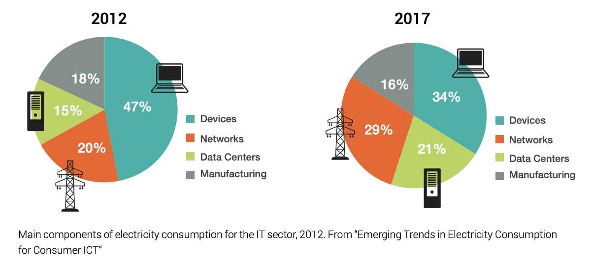

.. _carbon_footprint:

=====================
AI's carbon footprint
=====================

The ICT footprint
-----------------

The ICT sector is, nowadays, responsible for **4% of global CO2 emissions**
and its energy consumption is increasing by 9% every year [#]_.

Moreover, as shown below, datacenters and devices are responsible for more than 50% of the energy consumption
of the IT sector [#]_.

Large Neural Network Training footprint
---------------------------------------

In the summer of 2019, Strubell et al. [#]_ published a paper exposing the extensive 
footprint some large NLP neural network had during their training. For instance, they
claimed training BERT emitted ~650 kgCO2e and a neural architecture search (NAS) on the 
transformer architecture emitted ~284 tCO2e.

More recently, Patterson et al. [#]_ from Google completed Strubell et al. explaining 
there was a mistake in the first calculation of the footprint of the NAS. However, they
also revealed the footprint due to the training of GPT-3 : **552 tCO2e** !

While both studies point out the extensive footprint of training large neural networks,
Nvidia claims that "80 to 90 percent of the cost of machine learning at scale devoted to AI
inference" [#]_.

Taking all these facts into account, we think it is very important to be able to **measure
AI's emissions during both training and inference** (and even during preprocessing).

------------

.. [#] The Shift Project `ICT report <https://theshiftproject.org/article/climat-insoutenable-usage-video/>`_
.. [#] GreenPeace `ClickClean report <http://www.clickclean.org/>`_
.. [#] Strubell, E., Ganesh, A., & McCallum, A. (2019). Energy and policy considerations for deep learning in NLP. 
    arXiv preprint arXiv:1906.02243.
.. [#] Patterson, D., Gonzalez, J., Le, Q., Liang, C., Munguia, L. M., Rothchild, D., ... & Dean, J. (2021). 
    Carbon Emissions and Large Neural Network Training. arXiv preprint arXiv:2104.10350.
.. [#] HPC Wire `AWS to Offer Nvidia’s T4 GPUs for AI Inferencing
    <https://www.hpcwire.com/2019/03/19/aws-upgrades-its-gpu-backed-ai-inference-platform/>`_