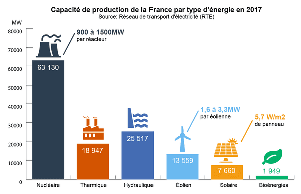

.. _carbon_scale :

===================
Some ideas of scale
===================

It is often quite hard to get an idea of scale when presented with figured of energy consumption or CO2 emissions.
Here are some comparison figures

Energy consumption
------------------

As a comparison, here are the energy production of power plants (average in France):

* A **nuclear reactor** produces between 900 and 1500 MW
* A **windmill** produces between 1.6 and 3.3 MW
* **Solar panels** produce 5.7 W/m2

CO2 emissions
-------------

As a comparison, here are the CO2 emissions of common concepts:

* 0.1 gCO2e = 1 breath
* 200 gCO2e = 1 km by car
* 950 kgCO2e = 1 passenger in a filght (for New-York San Francisco)
* 2 tCO2e = 1 person per year (objectives of the Paris agreement)
* 11 tCO2e = 1 French per year (average in 2020)